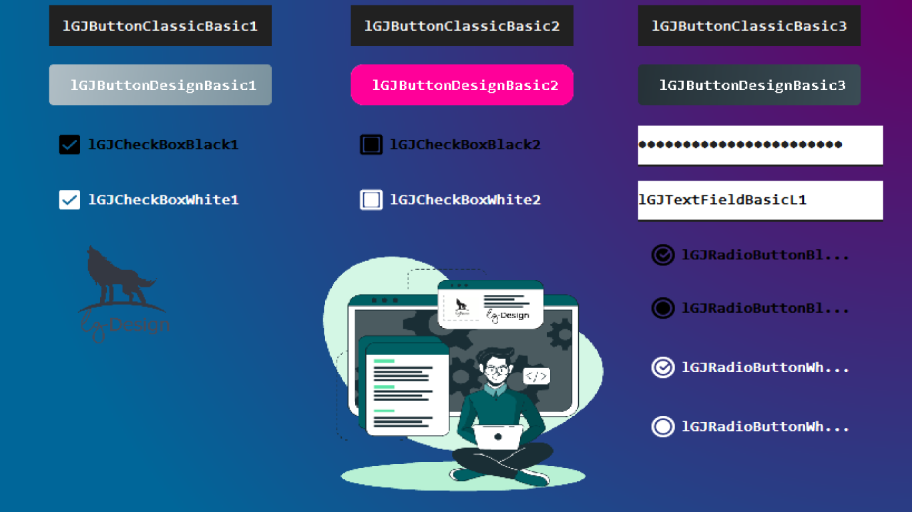

# LGBasicComponents1.0
This library contains components that can be added to the Netbeans palette, the .jar file contains everything you need. Initial version 1.0. There may be some small bugs but as time goes by I will try to improve them.  THESE COMPONENTS ARE COMPLETELY FREE FOR ANYONE WHO NEEDS THEM, SELLING THEM IS FORBIDDEN.  Please if you need help, you can contact me through my email luisgamas00@gmail.com

this is a screenshot where you can see the components...
RadioButton
CheckBox
Button Classic
Button Round Classic
Custom Panel Image
Label Custom Image

Donations for coffee... https://www.paypal.com/donate?hosted_button_id=5EZJ86XQPFAJ8&source=url

enjoy!.

